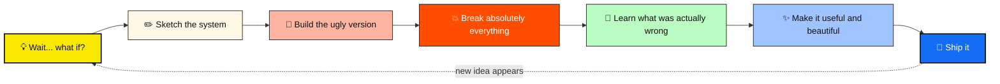
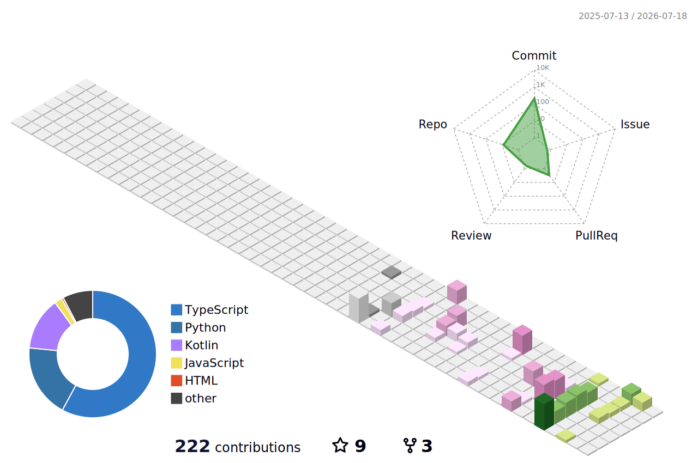
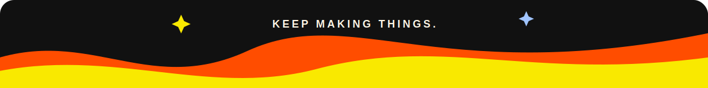

 

  

---

<table>
  <tr>
    <td width="62%" valign="top">
      <h2>Hi, I'm Ahan 👋</h2>
      

        I am a student engineer from Kolkata who likes projects with a little too
        much ambition.
      

      

        I build across <b>AI, full-stack development, Android, computer vision,
        automation, and robotics</b>. Not because I cannot pick a lane—but because
        the most interesting products usually live between lanes.
      

      

        My favorite kind of work starts with <i>“this might be difficult”</i> and
        ends with a real person being able to use it.
      

    </td>
    <td width="38%" valign="top">
      <h3>THE QUICK VERSION</h3>
      <pre>
📍 Kolkata, India
🧠 AI + product engineering
🤖 Robotics-curious
🛠️ Full-stack by necessity
🔥 Powered by difficult ideas
☕ Debugging fuel varies</pre>
    </td>
  </tr>
</table>

### `IDEA → MESS → PROTOTYPE → OBSESSION → SHIPPED`

 

  

 

---

## Things I have no business building this early — but built anyway

<table>
  <tr>
    <td width="50%" valign="top">
      <h3>🧠 <a href="https://github.com/ahansardar/SPARKY">SPARKY</a></h3>
      
<b>A private AI assistant that lives on your machine.</b>

      
Voice interaction, wake-word detection, vision, desktop automation, and local Ollama models—stitched into one assistant without making the cloud its entire personality.

      
<code>Python</code> <code>Ollama</code> <code>Computer Vision</code> <code>Automation</code>

    </td>
    <td width="50%" valign="top">
      <h3>🇮🇳 <a href="https://github.com/ahansardar/BharatScan">BharatScan</a></h3>
      
<b>A made-in-India document scanner with on-device intelligence.</b>

      
Built for Android using Jetpack Compose, CameraX, image segmentation, and OCR. The phone does the seeing; your documents stay where they belong.

      
<code>Kotlin</code> <code>Android</code> <code>CameraX</code> <code>On-device ML</code>

    </td>
  </tr>
  <tr>
    <td width="50%" valign="top">
      <h3>🍳 <a href="https://github.com/ahansardar/CookAlong">CookAlong</a></h3>
      
<b>Because recipe websites should help you cook—not test your patience.</b>

      
A guided cooking experience with search, step-by-step instructions, videos, timers, and multi-device support.

      
<code>Next.js</code> <code>TypeScript</code> <code>Supabase</code> <code>Product Design</code>

      <a href="https://cookalong.vercel.app/"><b>Try it live ↗</b></a>
    </td>

  </tr>
</table>

 

---

## My toolbox has commitment issues

  

  

  

| I use it to… | Tools I reach for |
| :--- | :--- |
| Make machines a little smarter | Python · PyTorch · OpenCV · Ollama · scikit-learn |
| Turn ideas into products | TypeScript · Next.js · React · Django · Flask |
| Build for phones and physical things | Kotlin · Android · Arduino · C++ · ROS |
| Keep the whole thing standing | PostgreSQL · Supabase · Git · Linux · GitHub Actions |

---

## How my brain usually gets from idea to product

> I care about architecture, but I care even more about whether the finished thing is fast, clear, useful, and pleasant to use.

---

## The numbers, since GitHub brought graphs

 

<b>Fine, show me the language graph too</b>

 

  

 
<i>Repository percentages measure code volume—not knowledge, taste, or the number of bugs stared at until 2 AM.</i>

---

## A tiny city built one contribution at a time

<picture>
  <source media="(prefers-color-scheme: dark)" srcset="./profile-3d-contrib/profile-season-animate.svg" />
  <source media="(prefers-color-scheme: light)" srcset="./profile-3d-contrib/profile-season-animate.svg" />
  
</picture>

 

<b>Every block is a day. Every bit of height is work done. The skyline rebuilds itself daily.</b>

---

<table>
  <tr>
    <td width="50%" valign="top">
      <h3>Right now, I am…</h3>
      <ul>
        <li>building practical AI tools</li>
        <li>going deeper into robotics and perception</li>
        <li>learning how strong systems survive real users</li>
        <li>collecting project ideas faster than free time</li>
      </ul>
    </td>
    <td width="50%" valign="top">
      <h3>I would love to meet…</h3>
      <ul>
        <li>builders with unusually ambitious ideas</li>
        <li>people working in AI, robotics, Android, or web</li>
        <li>open-source collaborators</li>
        <li>anyone who says “this is probably overkill” with affection</li>
      </ul>
    </td>
  </tr>
</table>

## Got something difficult in mind?

That is usually where the fun starts.

 

  

<a href="https://ahansardar.vercel.app"><b>Portfolio</b></a>
&nbsp;·&nbsp;
<a href="https://www.linkedin.com/in/ahansardar"><b>LinkedIn</b></a>
&nbsp;·&nbsp;
<a href="https://github.com/ahansardar?tab=repositories"><b>All Projects</b></a>

  

  

<b>Made by Ahan, several questionable ideas, and an unreasonable number of browser tabs.</b>

  

